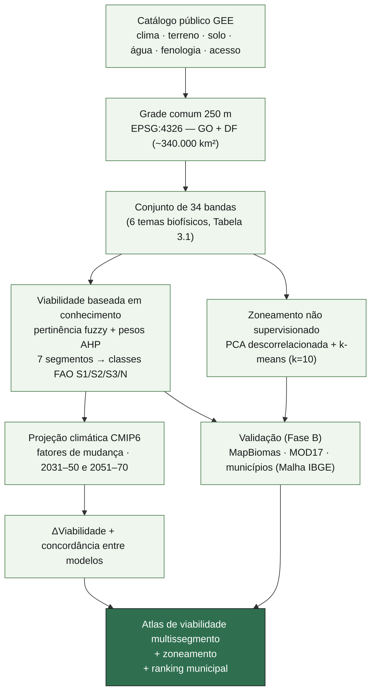
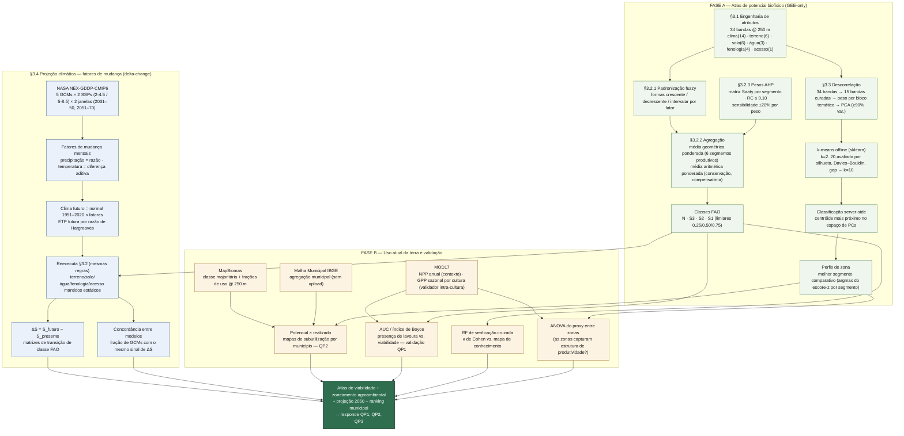
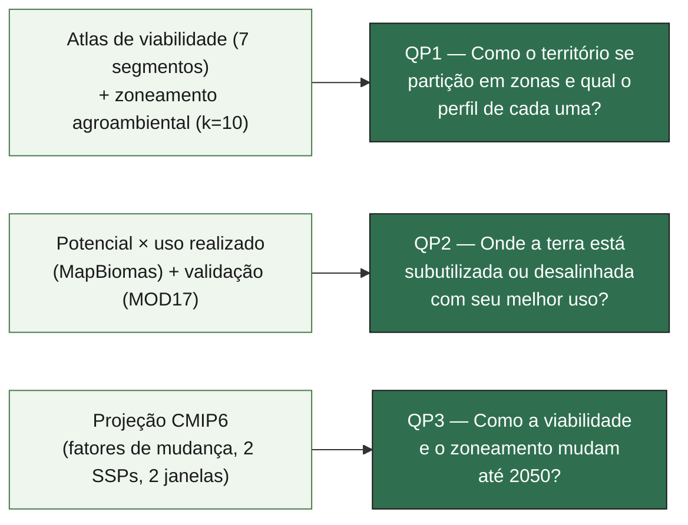

# Diagramas da Metodologia — Viabilidade Agrícola e Projeção Climática do Cerrado Goiano

> Material de apoio visual para reuniões de orientação e apresentações/pósteres.
> Os diagramas seguem a estrutura do Capítulo 3 (Metodologia) da dissertação e o pipeline
> efetivamente implementado no repositório (`notebooks/`, `src/`, `tools/`). Fonte de verdade
> textual: `../thesis/Chapters/03_methodology.tex` (racional completo) e `../CLAUDE.md` (estado de
> execução).

---

## 1. Visão geral (1 slide / poster)

Diagrama condensado — bom ponto de partida numa apresentação de 5–10 minutos ou num póster,
antes de entrar em detalhe.

**Leitura em uma frase:** dados públicos do catálogo GEE viram um cubo de 34 variáveis a 250 m;
esse cubo alimenta, em paralelo, (i) um motor de viabilidade por conhecimento especialista
(fuzzy + AHP) e (ii) um agrupamento não supervisionado em zonas; o motor de viabilidade é
reaplicado ao clima futuro do CMIP6 para projetar a mudança até meados do século; e tudo é
validado contra o uso real da terra e um indicador independente de produtividade.

---

## 2. Pipeline detalhado (para discussão com os orientadores)

Diagrama completo, organizado pelas secções do Capítulo 3. Fase A é o atlas de potencial
biofísico (auto-suficiente, só catálogo público); Fase B traz uso atual da terra e validação;
o bloco CMIP6 é a extensão temporal do motor de viabilidade da Fase A.

---

## 3. Da metodologia às questões de pesquisa

Diagrama curto para fechar a apresentação — liga cada bloco metodológico à pergunta de
investigação que ele responde.

---

## 4. Rastreabilidade — diagrama ⇄ secção da tese ⇄ código

Tabela de apoio para quando um orientador perguntar "isso está implementado onde?".

| Bloco do diagrama | Secção da tese | Notebook | Módulo `src/` |
|---|---|---|---|
| Engenharia de atributos (34 bandas) | §3.1 | `01`–`08` | `src/features.py`, `src/utils.py` |
| Viabilidade fuzzy + AHP | §3.2 | `09_suitability_fuzzy_ahp.ipynb` | `src/membership.py`, `config/segments.yaml`, `config/ahp_matrices.yaml` |
| Zoneamento (PCA + k-means) | §3.3 | `10_zoning_kmeans.ipynb` | `src/zoning.py` (`tools/rezone.py`) |
| Projeção CMIP6 (fatores de mudança) | §3.4 | `11_cmip6_shift.ipynb` | `src/cmip6.py` |
| Uso atual da terra / municípios | §3.5 | `12_municipal_gaul.ipynb`, `13_mapbiomas.ipynb` | `src/external.py` |
| Validação (AUC, Boyce, κ, ANOVA, GPP sazonal) | §3.5 | `14_validation_proxy_rf.ipynb` | `src/external.py`, `src/metrics.py` |
| Atlas final / figuras / ranking municipal | Cap. 4 | `15_atlas_app.ipynb` | `tools/make_figures.py`, `gee_js/atlas_app.js` |

---

### Notas de uso

- Os três primeiros diagramas são independentes — use o **§1** para a abertura de uma
  apresentação/póster, o **§2** para a discussão técnica em reunião de orientação, e o **§3**
  para fechar ligando método → resultado → pergunta de pesquisa.
- Cores seguem uma convenção simples: **verde** = Fase A (potencial biofísico), **azul** =
  bloco climático/CMIP6, **laranja** = Fase B (uso real + validação), **verde-escuro** = saída
  final.
- Para exportar como imagem (PNG/SVG) para o póster, renderize este ficheiro num visualizador
  Mermaid (ex.: [mermaid.live](https://mermaid.live)) ou na extensão Mermaid do editor/IDE.
